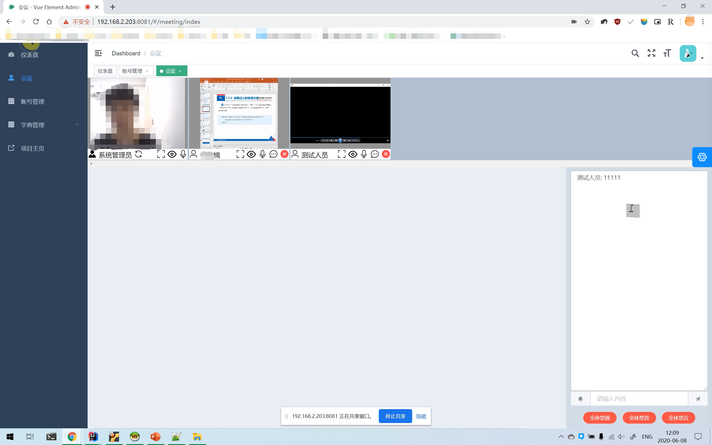
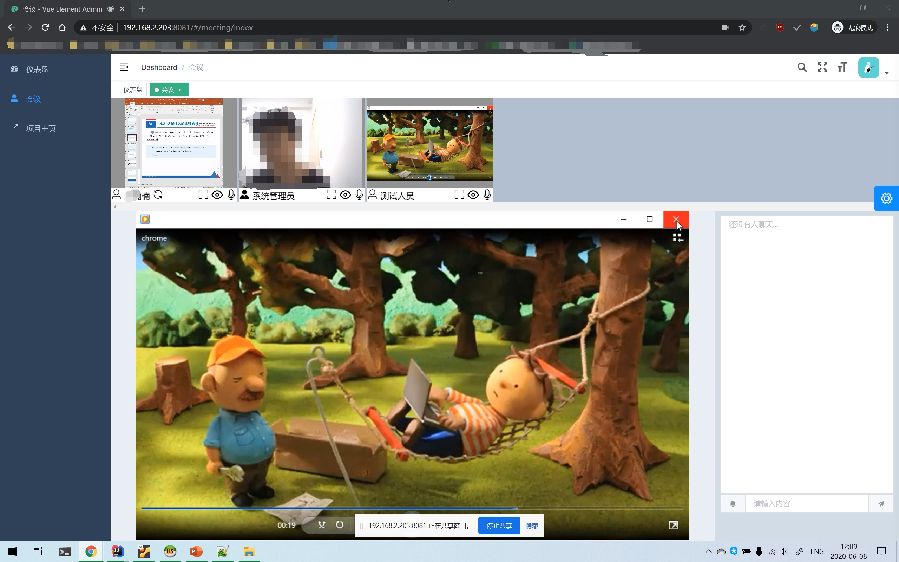

# MeetingWeb
视频会议的前端

使用webrtc实现图像传输。

vue+elementui

## 功能
视频通话

语音通话

共享桌面

大屏预览

聊天室

管理员控制成员视频麦克风等

不限制人数(人多可能会卡)

## 预览图

## 主要代码

`MeetingWeb\src\views\meeting`里是视频会议功能的模块代码

`index.vue` webrtc、websocket和界面布局的主要实现

​    `clients`变量内存储所有人的信息，`clients[0]`固定为自己。`clients[userId]`根据userId存放所有参加会议的人的信息和webrtc链接

`components`内的`Chat.vue`封装了聊天室控件

`components`内的`Preview.vue`封装了顶部所有人的视频小窗看控件

## 运行: 

先部署后端

https://github.com/nnn149/MeetingServer

删除https方法，这次commit提交对应的代码的全部删掉。

https://github.com/nnn149/MeetingWeb/commit/ef43a9af7d9e8a5855f7c7abb2bd04a3e080a878

然后参照

https://github.com/PanJiaChen/vue-element-admin

运行

